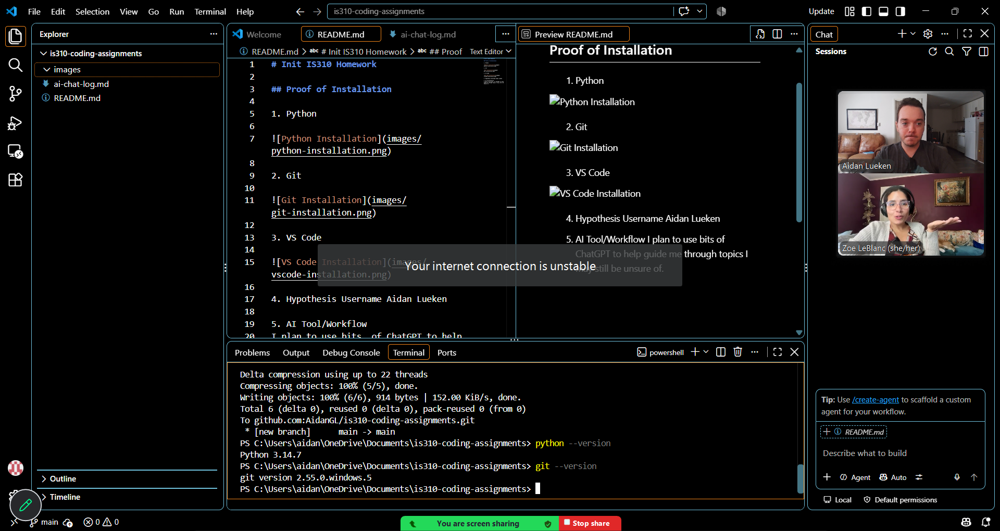

# Init IS310 Homework

## Proof of Installation

1. Python, Git, & VS Code

4. Hypothesis Username Aidan Lueken

5. AI Tool/Workflow
I plan to use bits  of ChatGPT to help guide me through topics I may still be unsure of.

